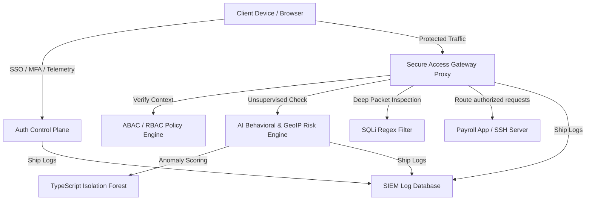

# ZTNA-Shield: AI-Powered Zero Trust Network Access Platform

ZTNA-Shield is an enterprise-grade Zero Trust Network Access (ZTNA) platform and Secure Access Gateway simulator. It implements continuous identity authentication, device posture checks, real-time behavioral analytics, and a Web Application Firewall (WAF) to replace traditional perimeter VPNs.

The platform features an interactive **Client Access Portal** (where users can request resources, trigger simulated cyber attacks, and enroll MFA) and a **SecOps Control Console (SOC)** displaying active sessions, device inventories, security policies, and live SIEM threat telemetry.

---

## 🛡️ Core Security Architecture

ZTNA-Shield operates strictly on the Zero Trust security philosophy of **"Never Trust, Always Verify."**



---

## ✨ Features

### 1. Identity and Session Lifecycle Protection
- **Standard & Federated Logins:** Supports password auth alongside Google/GitHub simulated Single Sign-On (SSO).
- **MFA Enrollment (RFC 6238):** Enrollment configuration displaying secrets, TOTP 6-digit challenge validations, and secure backup recovery codes.
- **Refresh Token Rotation (RTR):** Defends sessions from token hijacking by invalidating refresh tokens on reuse and rolling session credentials.
- **Brute Force Defense:** Automated lockout protection after 5 consecutive failures.

### 2. Device Posture Validation (ABAC)
- **Baseline Audits:** Validates client antivirus, firewall status, disk encryption, OS legacy configurations, and browser agents.
- **State Engine:** Categorizes endpoints into `Trusted`, `Unknown`, `Compromised`, or `Blocked` groups.
- **Simulator Panel:** Interactive floating simulator widget to adjust and compromise client specifications in real-time.

### 3. AI-Powered Anomaly & Threat Detection
- **Isolation Forest ML Model:** Built-from-scratch TypeScript anomaly detector evaluating typing dynamics (WPM, keypress timing) and mouse speed dynamics to block scripted bot attacks.
- **Impossible Travel Calculator:** Uses the Haversine formula to compute great-circle distance between coordinates of logins. Warp shifts trigger security blockades.
- **WAF Inspection:** Edge filters matching request query parameters against SQL Injection regex patterns to protect internal data nodes.

### 4. Continuous Authentication Protocol
- **Continuous Keepalive Polling:** Active browser sessions poll the gateway every 5 seconds. Context shifts (e.g. disabling local firewall) immediately terminate session tokens in the database, locking the client.

### 5. SecOps Administration & SIEM Dashboard
- **Threat Map:** HTML5 Canvas visualizer rendering real-time packet streams (and firewall block explosion sparks during attacks).
- **Policy Engine GUI:** Active policy builder for RBAC roles and ABAC criteria.
- **SIEM Audit Log Explorer:** Central search terminal filtering logs by category, priority, and strings.
- **Compliance Center:** Mapping platform settings to SOC 2, ISO 27001, GDPR, and NIST framework controls.

---

## 🛠️ Technology Stack

- **Frontend:** React 18, TypeScript, Tailwind CSS v3, Lucide Icons, Chart.js (react-chartjs-2)
- **Backend:** Node.js, Express, TypeScript, JWT (jsonwebtoken), bcryptjs
- **Database:** JSON-file database simulator (enabling zero-dependency local runs on any Windows/Mac platform)

---

## 🚀 Quick Start Guide

### Prerequisites
- Node.js (v18 or higher)
- npm (v9 or higher)

### Setup & Run
1. **Clone the Repository**
   ```bash
   git clone https://github.com/yourusername/ztna-shield.git
   cd ztna-shield
   ```
2. **Install Monorepo Workspaces & Dependencies**
   ```bash
   npm run install:all
   ```
3. **Start the Control Plane & Frontend Dashboard**
   ```bash
   npm start
   ```
   - **Frontend App:** [http://localhost:5173](http://localhost:5173)
   - **Backend API:** [http://localhost:5000](http://localhost:5000)

### Seed Accounts
The simulator database [db.json](db.json) automatically seeds on start:
- **SecOps Admin:** `admin@ztna-shield.internal` / `admin_password_101`
- **Employee User:** `employee@ztna-shield.internal` / `employee_password_101`
