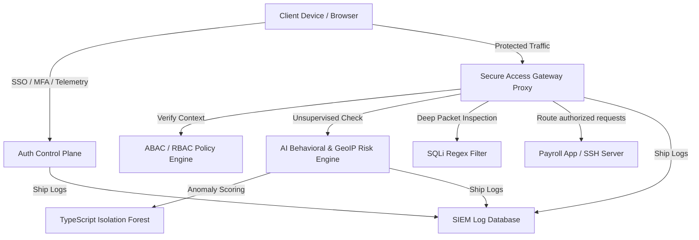

# ZTNA-Shield: Project Brain & Architectural Manifest

This document serves as the centralized repository metadata and architecture manifest for **ZTNA-Shield**. This single file contains the complete blueprint of the project, including its logical directory structure, module summaries, database layouts, APIs, and key algorithmic logic.

---

## 🏗️ Core Architecture & Concept
**ZTNA-Shield** is a Secure Access Gateway simulator designed on the Zero Trust security philosophy: **"Never Trust, Always Verify."** It implements continuous authentication, device posture checks, real-time behavioral analytics, and a Web Application Firewall (WAF).

### System Topology


---

## 📁 Repository Directory Structure

```
ZTNA-Shield-AI-Powered-Zero-Trust-Network-Access-Platform-main/
├── package.json                   # Monorepo configuration and workspace start scripts
├── vercel.json                    # Root deployment routes mapping /api/(.*) -> api/index.ts
├── db.json                        # File-based database seed (users, devices, policies, logs)
├── api/                           # Vercel serverless folder
│   └── index.ts                   # Express server proxy endpoint
├── backend/                       # Node.js + Express + TypeScript backend control plane
│   ├── package.json               # Backend dependencies (express, cors, jsonwebtoken, bcryptjs)
│   ├── tsconfig.json              # TypeScript compilation config
│   └── src/                       # Backend source directory
│       ├── server.ts              # Express Server setup and middleware configuration
│       ├── db.ts                  # JSON Database accessors, interfaces, and SIEM logging
│       ├── auth.ts                # AuthService (TOTP, Brute force, RTR Session management)
│       ├── device.ts              # DeviceTrustEngine (Client posture & risk evaluations)
│       ├── policy.ts              # PolicyEngine (RBAC/ABAC rule validator & JIT requests)
│       ├── risk.ts                # RiskAssessmentEngine & custom Isolation Forest ML class
│       └── routes/                # Express API Route controllers
│           ├── authRoutes.ts      # Auth handler: login, register, MFA steps, token rotation
│           ├── deviceRoutes.ts    # Device posture updates and listing (Admins only)
│           ├── gatewayRoutes.ts   # Continuous Auth status, access gateway, WAF, JIT submits
│           └── adminRoutes.ts     # Admin panel data, manual revokes, JIT approvals, SIEM log filters
├── frontend/                      # Vite + React + TypeScript + Tailwind CSS client portal
│   ├── package.json               # Frontend dependencies (react-chartjs-2, chart.js, lucide-react)
│   ├── index.html                 # Main HTML layout wrapper
│   ├── vite.config.ts             # Vite server configurations
│   ├── tailwind.config.js         # Custom cyber-color themes and neon shadow extensions
│   └── src/                       # Frontend source directory
│       ├── main.tsx               # Client bootstrap entrypoint
│       ├── App.tsx                # Context wrapper, router, and persistent debug terminal UI
│       ├── App.css                # Custom animation keyframes and background pattern grid styles
│       ├── index.css              # Global styles and Tailwind directives
│       ├── context/
│       │   └── SimulationContext.tsx # Simulated device context, state manager, auth data mapping
│       ├── utils/
│       │   ├── api.ts             # Custom HTTP request wrap injecting simulated device headers
│       │   └── fingerprint.ts     # Canvas fingerprinting, OS parse, Mouse & Typing Telemetry
│       └── components/
│           ├── LoginPortal.tsx    # Auth forms, Slider Captcha, SSO, and Telemetry bindings
│           ├── ClientPortal.tsx   # Client dashboard, MFA enrollment, resources, attack simulators
│           ├── SOCDashboard.tsx   # SecOps metrics, dynamic threat map canvas, Policy editor, logs
│           └── DeviceSimulatorWidget.tsx # Floating control panel to compromise client settings
└── CyberShield-AI-WAF/            # Standalone Python Web Application Firewall project
    ├── vercel.json                # WAF vercel serverless route configuration
    ├── requirements.txt           # Python dependencies
    ├── api/
    │   └── index.py               # Flask app entrypoint
    └── WAF-CyberDefense/
        ├── app.py                 # Streamlit + Flask dashboard containing WAF regex engines
        ├── requirements.txt       # Streamlit WAF Python libraries
        └── attack_logs.json       # JSON-based attack log databases
```

---

## 🗃️ Simulated Database Schema & Types

Defined in [backend/src/db.ts](file:///e:/121/ZTNA-Shield-AI-Powered-Zero-Trust-Network-Access-Platform-main/backend/src/db.ts).

### 1. `User` Interface
Represents corporate employee account configurations.
```typescript
export interface User {
  id: string;
  email: string;
  passwordHash: string;
  role: 'Super Admin' | 'Security Administrator' | 'IT Administrator' | 'Manager' | 'Employee' | 'Guest';
  department: string;
  mfaSecret: string | null;
  mfaEnabled: boolean;
  mfaBackupCodes: string[];
  status: 'active' | 'locked' | 'suspended';
  failedLoginAttempts: number;
  lockoutUntil: string | null;
  createdAt: string;
}
```

### 2. `Device` Interface
Exposes client environment configuration posture.
```typescript
export interface Device {
  id: string;
  userId: string;
  fingerprint: string;
  macHash: string;
  hostname: string;
  os: string;
  browser: string;
  diskEncryption: boolean;
  firewall: boolean;
  antivirus: boolean;
  status: 'Trusted' | 'Unknown' | 'Compromised' | 'Blocked';
  registeredAt: string;
  lastActive: string;
}
```

### 3. `Session` Interface
Continuous session context attributes binding IPs, VPNs, and risk scores.
```typescript
export interface Session {
  id: string;
  userId: string;
  deviceId: string | null;
  token: string;
  refreshToken: string;
  riskScore: number;
  location: {
    ip: string;
    country: string;
    city: string;
    vpn: boolean;
    tor: boolean;
  };
  userAgent: string;
  lastVerified: string;
  expiresAt: string;
  active: boolean;
}
```

### 4. `AuditLog` (SIEM Log) Interface
Telemetry records sent from authentication services, devices, or gateway.
```typescript
export interface AuditLog {
  id: string;
  timestamp: string;
  category: 'auth' | 'device' | 'gateway' | 'threat' | 'compliance';
  level: 'info' | 'warning' | 'error' | 'critical';
  userId?: string;
  userEmail?: string;
  ip: string;
  country: string;
  message: string;
  details: string;
}
```

### 5. `SecurityPolicy` Interface
Access criteria parsed by the gateway policy engine.
```typescript
export interface SecurityPolicy {
  id: string;
  name: string;
  description: string;
  type: 'RBAC' | 'ABAC';
  rules: {
    roles?: string[];
    minTrustLevel?: 'Trusted' | 'Unknown';
    allowedCountries?: string[];
    maxRiskScore?: number;
    allowedTimeStart?: string;
    allowedTimeEnd?: string;
  };
  active: boolean;
}
```

### 6. `JITRequest` (Just-In-Time) Interface
Requests to temporarily override role constraints.
```typescript
export interface JITRequest {
  id: string;
  userId: string;
  userEmail: string;
  resource: string;
  durationMinutes: number;
  reason: string;
  status: 'pending' | 'approved' | 'rejected';
  approvedBy?: string;
  createdAt: string;
  expiresAt?: string;
}
```

---

## 🛰️ API Routes & Endpoints Reference

### 🔒 Authentication System: `/api/auth`
Exposed in [backend/src/routes/authRoutes.ts](file:///e:/121/ZTNA-Shield-AI-Powered-Zero-Trust-Network-Access-Platform-main/backend/src/routes/authRoutes.ts)

*   `POST /register`: Adds user to mock DB. Expects `{ email, password, role, department }`.
*   `POST /login`: Validates password. Triggers 10-minute lockout after 5 failures. Starts MFA flow if enabled, or issues JWTs. Captures client telemetry.
*   `POST /mfa/verify`: Validates 6-digit TOTP secret (or backup code). Updates session.
*   `POST /mfa/enable/step1`: Generates TOTP secret and QR URL string. Requires authenticated headers.
*   `POST /mfa/enable/step2`: Validates user TOTP setup code. Sets `mfaEnabled: true` in user record and returns backup codes.
*   `POST /refresh`: Rotates credentials. Verifies old refresh token and rotates token keys (Refresh Token Rotation - RTR).
*   `POST /logout`: Invalidates the session (`active: false`) in DB.

### 🛡️ Access Gateway: `/api/gateway`
Exposed in [backend/src/routes/gatewayRoutes.ts](file:///e:/121/ZTNA-Shield-AI-Powered-Zero-Trust-Network-Access-Platform-main/backend/src/routes/gatewayRoutes.ts)

*   `GET /session-status`: Polling endpoint triggered by client browser every 5s. Re-evaluates device posture, updates dynamic session risk, and executes policy checks. Dynamic violation immediately terminates session in DB.
*   `GET /access/:resource`: Proxy gateway protecting backend nodes (`payroll`, `ssh`, `api`). Runs deep-packet inspections (WAF block on SQL Injection payloads), and verifies policy eligibility.
*   `POST /jit-request`: Submits ticket request for temporary permission overrides.

### ⚙️ Posture Directories: `/api/devices`
Exposed in [backend/src/routes/deviceRoutes.ts](file:///e:/121/ZTNA-Shield-AI-Powered-Zero-Trust-Network-Access-Platform-main/backend/src/routes/deviceRoutes.ts)

*   `GET /`: Fetches all registered devices in the directory. (Admin only)
*   `PUT /:id/status`: Modifies device state override (`Trusted` | `Unknown` | `Compromised` | `Blocked`). (Admin only)
*   `DELETE /:id`: Deletes device registry configuration. (Admin only)

### 📊 Administration: `/api/admin`
Exposed in [backend/src/routes/adminRoutes.ts](file:///e:/121/ZTNA-Shield-AI-Powered-Zero-Trust-Network-Access-Platform-main/backend/src/routes/adminRoutes.ts) (All routes require Admin authorization)

*   `GET /metrics`: Aggregates user numbers, active session counts, compromised/blocked devices, SIEM threats, and average risk.
*   `GET /sessions`: Lists all session objects.
*   `POST /sessions/:id/revoke`: Administratively kills active session token.
*   `GET /logs`: Queries centralized SIEM logs (supports search query `q`, level, category filters).
*   `GET /policies`: Lists policies.
*   `POST /policies`: Installs new RBAC/ABAC gateway rules.
*   `PUT /policies/:id`: Edits policy configurations.
*   `DELETE /policies/:id`: Purges policy entries.
*   `GET /jit-requests`: Fetches all JIT tickets.
*   `PUT /jit-requests/:id/approve`: Approves JIT request and computes expiration timestamp.
*   `PUT /jit-requests/:id/reject`: Rejects JIT request.

---

## 🧠 Core Engineering & Code Highlights

### 1. Custom TypeScript Isolation Forest ML Model
Implemented in [backend/src/risk.ts](file:///e:/121/ZTNA-Shield-AI-Powered-Zero-Trust-Network-Access-Platform-main/backend/src/risk.ts).
An unsupervised machine learning model written in pure TypeScript for behavioral anomaly classification (detecting bots vs humans).
*   **Attributes evaluated:** Mouse speed/velocity, Mouse Jerk (rate of change of acceleration), keyboard typing WPM (words per minute), Tor usage, VPN usage.
*   **Logic:**
    *   Constructs a forest of `IsolationTree` components.
    *   Splits attributes recursively using randomized thresholds.
    *   Measures the average path length required to isolate a given datapoint.
    *   Applies the Euler-Mascheroni constant approximation:
        \(c(n) = 2 \ln(n - 1) + 2(0.5772156649) - \frac{2(n - 1)}{n}\)
    *   Computes anomaly score:
        \(s(x, \psi) = 2^{-\frac{E(h(x))}{c(\psi)}}\)
    *   Scores above `0.65` dynamically trigger risk score penalties.

### 2. Impossible Travel Haversine Distance Calculator
Implemented in [backend/src/risk.ts](file:///e:/121/ZTNA-Shield-AI-Powered-Zero-Trust-Network-Access-Platform-main/backend/src/risk.ts).
Prevents geographic warp attacks by verifying traveling speeds between consecutive login events:
*   Resolves great-circle distance between capital coordinates using the Haversine formula:
    \(d = 2 R \arcsin\left(\sqrt{\sin^2\left(\frac{\Delta \phi}{2}\right) + \cos(\phi_1)\cos(\phi_2)\sin^2\left(\frac{\Delta \lambda}{2}\right)}\right)\)
*   Computes travel velocity: \(v = \frac{d}{\Delta t}\)
*   Velocities exceeding commercial airline flight speed limits (\(>550 \text{ mph}\)) trigger critical SIEM alerts and block session access.

### 3. Device Posture Evaluator
Implemented in [backend/src/device.ts](file:///e:/121/ZTNA-Shield-AI-Powered-Zero-Trust-Network-Access-Platform-main/backend/src/device.ts).
Verifies baseline integrity attributes during authentication:
*   Antivirus deactivated: +30 risk penalty.
*   Firewall disabled: +20 risk penalty.
*   Disk Encryption deactivated: +15 risk penalty.
*   Legacy OS platforms (Windows XP, Windows 7, Mac OS 10.11): +40 risk penalty; forces state immediately to `Compromised`.
*   Internet Explorer browser agents: +25 risk penalty; forces state immediately to `Compromised`.
*   States:
    *   Risk Penalty \(\ge 40\): `Compromised`
    *   Risk Penalty \(> 0\): `Unknown`
    *   Risk Penalty \(= 0\): `Trusted`

### 4. Continuous Authentication Keepalive Protocol
Implemented in [backend/src/routes/gatewayRoutes.ts](file:///e:/121/ZTNA-Shield-AI-Powered-Zero-Trust-Network-Access-Platform-main/backend/src/routes/gatewayRoutes.ts) and [frontend/src/components/ClientPortal.tsx](file:///e:/121/ZTNA-Shield-AI-Powered-Zero-Trust-Network-Access-Platform-main/frontend/src/components/ClientPortal.tsx).
Ensures session validation is dynamic:
*   Active client browsers poll `/api/gateway/session-status` every 5 seconds.
*   The gateway re-evaluates all device posture contexts.
*   If a client turns off their firewall or antivirus locally mid-session, the gateway immediately revokes their session token in the database (`active = false`), locking them out.

### 5. Web Application Firewall (WAF) Deep Packet Inspection
Implemented in [backend/src/routes/gatewayRoutes.ts](file:///e:/121/ZTNA-Shield-AI-Powered-Zero-Trust-Network-Access-Platform-main/backend/src/routes/gatewayRoutes.ts).
Inspects incoming traffic at the secure access gateway:
*   Scans parameters, bodies, and resource paths against regex signatures:
    `/'|--|#|\bUNION\b|\bSELECT\b|\bOR\b\s+['"]?\d+['"]?\s*=\s*['"]?\d+['"]?/i`
*   Catches payloads like `' OR 1=1 --` or SQL `UNION SELECT` operations, blocking the request with HTTP `403 Forbidden` and logging the alert.

---

## ⚡ Setup & Run Orchestration

Orchestrated in the root [package.json](file:///e:/121/ZTNA-Shield-AI-Powered-Zero-Trust-Network-Access-Platform-main/package.json):
*   **Prerequisites:** Node.js (v18+) and npm (v9+).
*   **Install Workspace Dependencies:**
    ```bash
    npm run install:all
    ```
    *(Runs `npm install` recursively at root, `/backend`, and `/frontend`)*
*   **Startup command:**
    ```bash
    npm start
    ```
    *(Launches Express Backend control plane on port `5000` and Vite React Frontend dev server on port `5173` concurrently)*
*   **Seed Credentials:**
    *   **SecOps Admin:** `admin@ztna-shield.internal` / `admin_password_101`
    *   **Employee User:** `employee@ztna-shield.internal` / `employee_password_101`
